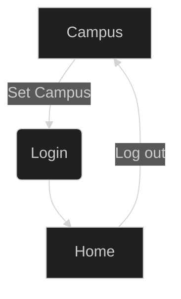

# React Project

## What's inside?

- [npm](https://www.npmjs.com/) as a package manager
- [Node](https://nodejs.org/en) v.20.9.0
- [Vite](https://ko.vitejs.dev/)
- [React](https://react.dev/)
- [TypeScript](https://www.typescriptlang.org/) for static type checking
- [ESLint](https://eslint.org/) for code linting
- [Prettier](https://prettier.io) for code formatting
- [Styled Component](https://styled-components.com/) for styling
- [Material UI](https://mui.com/) for styling
- [recoil](https://recoiljs.org/ko/) for status management
- [axios](https://axios-http.com/kr/docs/intro) for server communication

### Build

To build all apps and packages, run the following command:

```
npm run build
```

### Develop

To develop all apps and packages, run the following command:

```
npm install

npm run dev
```

### Commit

using conventional commit

```
build: Changes that affect the system or external vitality
ci: Change ci configuration files and scripts
chore: When setting up a package manager, change the settings without modifying the code.
docs: Change documentation
feat: New Feature
fix: bug fix
perf: Performance improvements
refactor: Code changes, refactorings that do not fix bugs or add functionality
style: Code changes, refactorings that do not fix bugs or add functionality
test: Add missing tests or modify existing tests
revert: revert worked

ex. fix: Main bug fixed
```

### Folder Structure

```
@type : Management of repeatedly used types and interfaces
api : api file management folder
assets : Static file management folder
components : Reuse or manage templates folder
hooks : Custom hooks folder
pages : Folder and component management by routing (page)
provider : Globally used window object provider
route :Routing Management
store : State Management (Recoil)
styles : GlobalStyle, Reuse Styled components mangement
utils : Common function management
```

### Example Source Flow



- Campus : Create Campus, Delete Campus
When you register a new campus, it is registered in StateMangement and also registered in LocalStorage by Recoil Persist. The same goes for campus deletion.

- Set Campus : Select your campus, Routed to the login page
When a campus is selected, the campus selected by the user is registered in the store and also registered in local storage by recoil persist.

- Login : After Login, Routed to the Main page
When you log in, a token is created, stored in state management, and registered in local storage by recoil persist.

- Logout : When you log out, the token and campus are removed from local storage. The Auth component monitors the token and campus and logs out when they disappear.

** Since we are not currently registered on the actual server, token generation and campus creation were handled by random functions.
